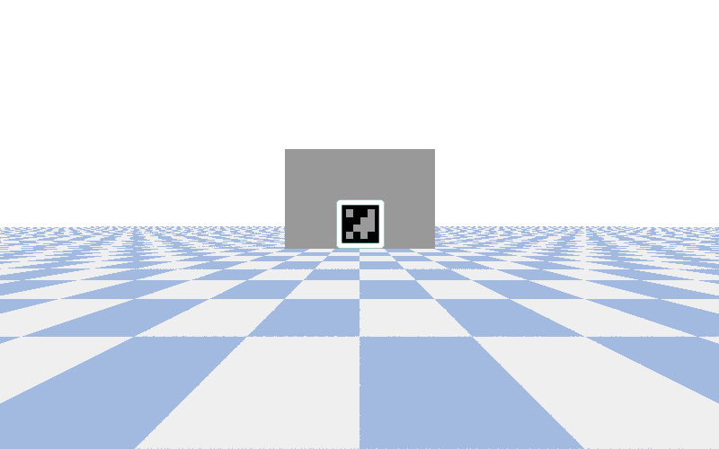

### Instructions
- `src/env.yml` contains the conda environment config file. Create an environment (here, called `ibvs`) and load it in as usual:
```bash 
cd src 
conda env create -f env.yml
conda activate ibvs  
```
- run the pybullet sim in `DIRECT` mode, with images saved to `src/img/`. 
```bash
cd src 
python index.py
```
- if required, convert the images into an MP4 file for later analysis, storing the video in `src/vid/`
```
bash create_vid.sh
```

#### Demo 

|  |  |
|:---:|:---:|
| Target Image | Output GIF |

### TODO
- [ ] port to `airobot` to get rid of view matrix complexity
- [ ] use a better target and scene, add some acknowledgements 
- [ ] experiment with more complex dof. Currently simply taking the first three points' (x, y) coords as our 6 dof. 
- [ ] find out why the obstacles fall slowly in the p.DIRECT sim even though it does not seem to happen in p.GUI. 
